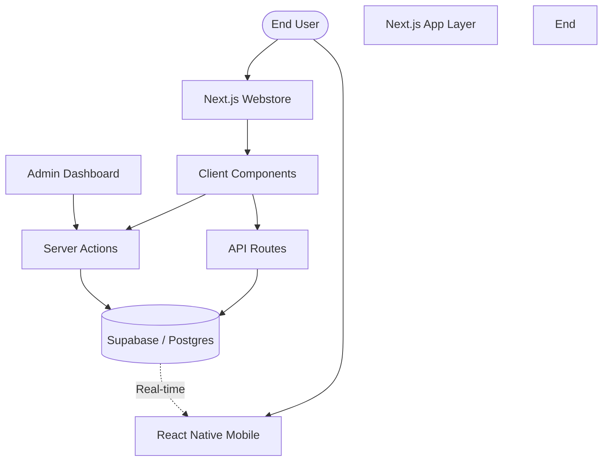
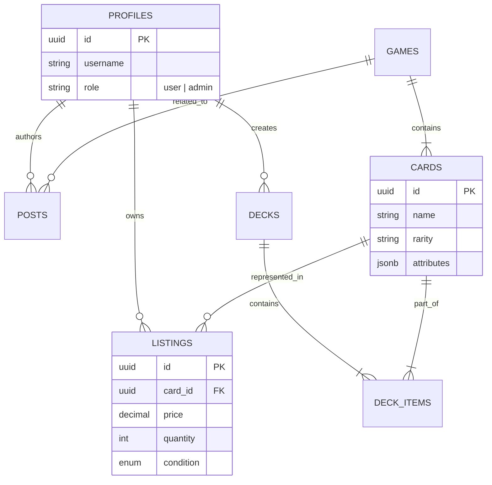

# TCG Marketplace Architecture

This document provides a technical overview of the TCG Marketplace system, detailing its architectural decisions, data flow, and core engine implementations.

---

## 🏛️ System Overview

The system follows a modern **Decoupled Architecture** leveraging the Next.js 14 App Router as the primary application layer and Supabase as the backend-as-a-service (BaaS) and real-time data engine.



---

## 🔄 Unified Data Flow: Faceted Search

The faceted search system is the most complex data journey in the platform. It synchronizes local UI state with the browser's URL and the database's indexed results.

### High-Level Search Pipeline:
1.  **State Initiation**: User interacts with `FilterSidebar.tsx`.
2.  **Filter Synchronization**: The `SearchPage.tsx` updates the local `filters` state via user action.
3.  **Query Execution**: `TanStack Query` detects the key change (filters) and triggers `cardService.getPaginatedCards`.
4.  **Resilient Execution**: The service attempts a fetch from `/api/cards/search`. If the API is unavailable (404), it falls back to an **Intelligent Mock Engine** that applies client-side filtering logic to curated assets.

> [!TIP]
> **Performance Optimization**: `useMemo` is used in `CardGrid.tsx` to prevent redundant re-renders of the entire catalog when only a single filter toggles.

---

## 🛒 The Marketplace Engine

The Marketplace Engine is responsible for aggregating individual listings into a unified card view.

### Listing Aggregation Logic:
Unlike traditional e-commerce items, a unique `card_id` can have multiple listings with different conditions (NM, LP, DMG).
- **Primary Inquiry**: When a user views a product, the system fetches all `listings` where `card_id = :id`.
- **Market Valuation**: The engine calculates the **Market Price** based on a weighted average of recent sales index data, updated via periodic background cron jobs.

---

## 🏗️ Bulk Import Strategy

The Bulk Import engine enables high-volume inventory entry through a standardized textual format.

### Format & Parsing:
```regex
/^[a-zA-Z0-9]+_[a-zA-Z0-9]+_\d+$/
```
- **Pattern**: `[gameid]_[cardid]_[count]` (e.g., `pkm_char-001_12`)
- **Flow**:
  1.  **Client-side Parsing**: Input is split into lines and validated line-by-line using the regex pattern.
  2.  **Database RPC**: Validated items are sent as a JSONB array to the `handle_bulk_import` PostgreSQL function.
  3.  **Atomic Transaction**: The function performs a PostgreSQL transaction, ensuring all items are indexed into the `listings` or `deck_items` tables simultaneously, or the entire operation rolls back.

---

## 📊 Database Topology

The relational schema is normalized for high scalability and secure data isolation.



---

## 🛡️ Security & Access Control

### Row Level Security (RLS)
Supabase RLS is the core of our security model. It ensures that users can only interact with the data they own or are authorized to see.
- **Listings**: Only the owner (`seller_id`) can `UPDATE` or `DELETE` a listing. `READ` access is public.
- **Admin Roles**: The `/admin` routes and specific RPC functions check the `role` field in the `profiles` table before execution.

### Schema Validation
All data entering the system via Server Actions is strictly sanitized using **Zod Schemas**, preventing malicious payloads or malformed data from reaching the database.

---

> [!IMPORTANT]
> **Data Integrity**: All marketplace transactions and bulk imports are logged in the `audit_logs` table to maintain a transparent history of inventory changes.
